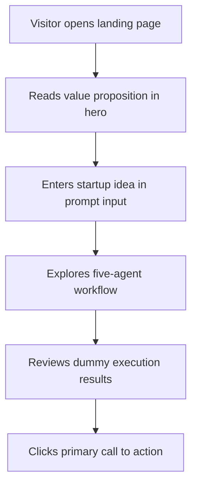

## 1. Product Overview
StartupPilot AI is a premium SaaS landing page for an AI startup assistant that turns one prompt into a full startup execution workflow.
- The page targets founders, indie hackers, and early-stage startup teams who want research, strategy, content, product building, and pitch support in one place.
- The main goal is to communicate a high-end AI product, increase product interest, and showcase the five-agent workflow with believable dummy results.

## 2. Core Features

### 2.1 Feature Module
1. **Landing page**: dark-mode premium hero, prompt input, workflow explanation, results preview, CTA surfaces

### 2.2 Page Details
| Page Name | Module Name | Feature description |
|-----------|-------------|---------------------|
| Landing page | Top navigation | Minimal SaaS navigation with logo, product links, and CTA button |
| Landing page | Hero section | Large headline, supporting copy, dark premium visuals, trust indicators, and a single prompt input box |
| Landing page | Prompt composer | One prominent input area with example startup prompt, quick action button, and supporting hint text |
| Landing page | Workflow section | Five connected agent cards for Research Agent, Strategy Agent, Content Agent, Development Agent, and Pitch Agent |
| Landing page | Results section | Dummy output cards showing insights, roadmap, messaging, product tasks, and investor summary |
| Landing page | Social proof strip | Dummy metrics, partner-style labels, and startup credibility indicators |
| Landing page | Final CTA/footer | Conversion-focused CTA, compact footer links, and product branding |

## 3. Core Process
The visitor lands on the page, understands the product promise, enters a startup idea into the single prompt input, reviews how the AI workflow progresses across five specialized agents, and scrolls to see example results that make the product feel concrete and valuable.

The page is optimized for conversion: immediate product understanding above the fold, a clear workflow in the middle, and convincing results below to reduce uncertainty before the final call to action.

## 4. User Interface Design
### 4.1 Design Style
- Primary colors: near-black background, graphite panels, soft off-white text, electric cyan accent, and subtle emerald highlight
- Button style: rounded large buttons with glass-dark surfaces, soft glow, and premium hover motion
- Font and sizes: elegant display serif for major headlines paired with a refined sans-serif for interface copy; oversized desktop hero typography
- Layout style: desktop-first layered composition with generous spacing, framed content blocks, subtle gradients, and card-based storytelling
- Icon style suggestions: minimal line icons, glowing dots, agent badges, and diagram-like connectors

### 4.2 Page Design Overview
| Page Name | Module Name | UI Elements |
|-----------|-------------|-------------|
| Landing page | Hero section | Oversized headline, split layout, gradient glow, glass panel, trust chips, prompt input, CTA buttons |
| Landing page | Prompt composer | Single wide input, example prompt text, submit icon/button, muted helper copy |
| Landing page | Workflow section | Connected timeline/grid cards, numbered agent labels, mini descriptions, status indicators |
| Landing page | Results section | Analytics-style cards, progress bars, lists, metric badges, generated summaries, premium shadows |
| Landing page | Final CTA/footer | High-contrast CTA panel, compact link groups, subtle border treatments |

### 4.3 Responsiveness
- Desktop-first layout with strong visual hierarchy and wide hero spacing
- Tablet layout keeps section layering but reduces horizontal density
- Mobile layout stacks modules vertically, preserves the single prompt input as the primary interaction, and keeps CTA buttons thumb-friendly
- Motion and decorative effects should degrade gracefully on smaller screens to maintain clarity and performance
