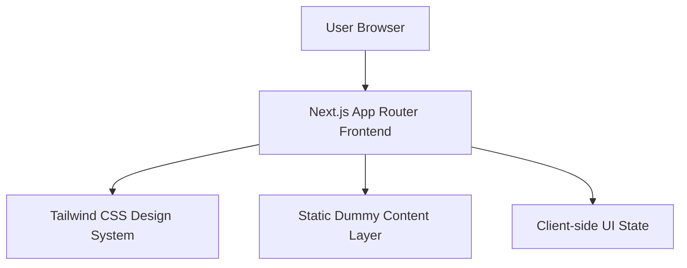
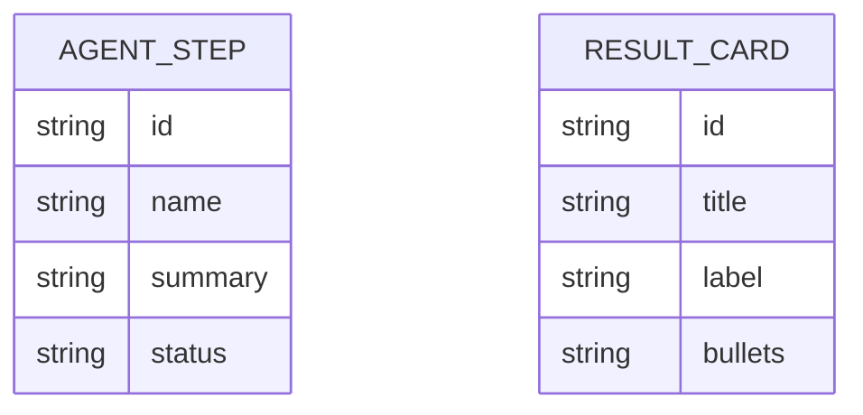

## 1. Architecture Design


## 2. Technology Description
- Frontend: Next.js 15 + React 19 + TypeScript + Tailwind CSS
- UI Composition: App Router with server-first page structure and client components only where interaction is needed
- Styling: Tailwind utility classes with CSS variables for dark-mode tokens and reusable premium surface patterns
- Component Direction: shadcn-style primitives and section components built locally with dummy data only
- Icons/Visuals: Lucide-style icon approach or inline SVG patterns if needed
- Deployment Target: Static-friendly marketing page suitable for Vercel deployment

## 3. Route Definitions
| Route | Purpose |
|-------|---------|
| / | Main StartupPilot AI landing page with hero, workflow, results, and CTA |

## 4. API Definitions
No backend APIs are required for this implementation because the experience uses dummy content only. The prompt input is presentational and may trigger local UI feedback without any external request.

Example local data shapes:

```ts
type AgentStep = {
  id: string
  name: string
  summary: string
  status: "complete" | "active" | "queued"
}

type ResultCard = {
  id: string
  title: string
  label: string
  bullets: string[]
}
```

## 5. Component Architecture
The page is organized into a small, maintainable set of marketing-focused components:

- `app/layout.tsx`: root layout, metadata, dark theme body styling
- `app/page.tsx`: landing page composition and dummy data wiring
- `components/sections/hero-section.tsx`: hero copy, prompt input, trust strip
- `components/sections/workflow-section.tsx`: five-agent process visualization
- `components/sections/results-section.tsx`: generated-result preview cards
- `components/sections/footer-cta.tsx`: final call to action and footer area
- `components/ui/*`: small shadcn-style reusable presentation primitives if needed

## 6. Data Model
### 6.1 Data Model Definition


### 6.2 Data Definition Language
No database schema is required. All content is stored as static TypeScript arrays inside the frontend codebase for dummy presentation.

## 7. Rendering and Responsiveness Strategy
- Use responsive Tailwind layouts with desktop-first composition and controlled stacking on smaller screens
- Keep the hero section visually dominant with layered backgrounds and large-scale typography
- Use semantic HTML and accessible contrast for dark mode
- Prefer CSS-driven animation and hover states for premium feel with minimal runtime cost

## 8. Implementation Notes
- Initialize a new Next.js 15 application if the workspace is empty
- Configure Tailwind CSS and global theme tokens
- Keep the entire landing page in dark mode by default
- Avoid real authentication, API calls, persistence, or analytics integrations
- Populate workflow and results sections from local dummy arrays for easy iteration
